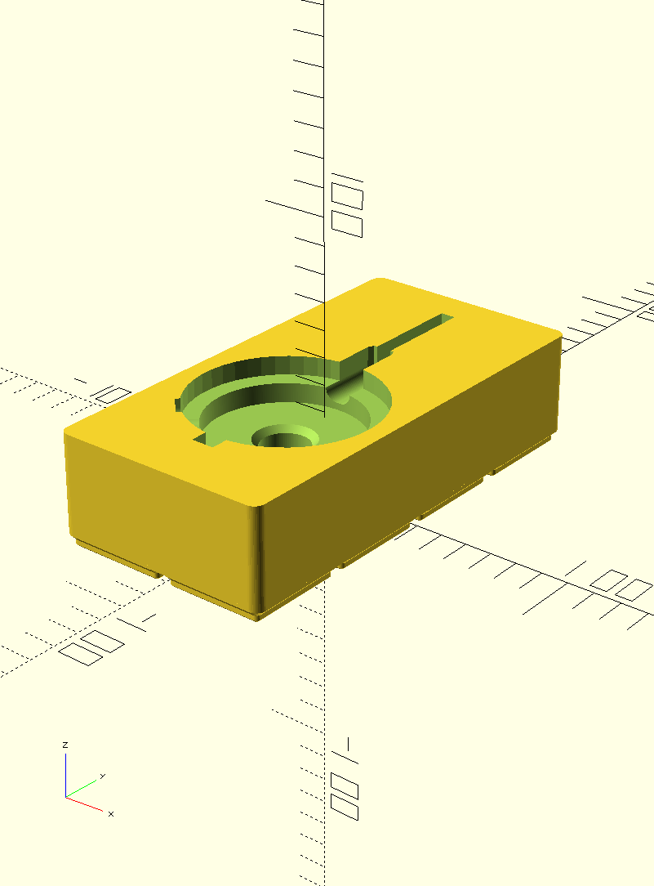
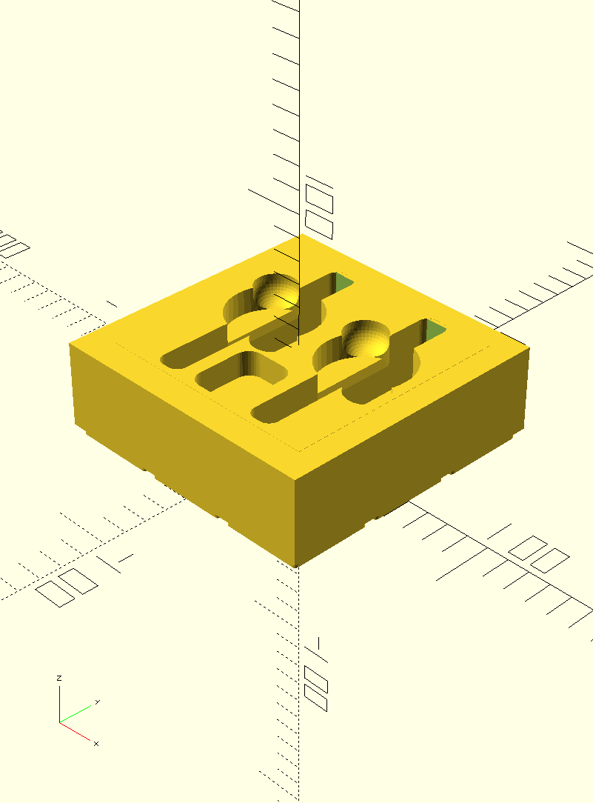

# gridfinity-contrib

## Introduction
This repository contains a number of gridfinity bins that I needed, but couldn't find a pre-existing solution for. This repository relies extensively on https://github.com/kennetek/gridfinity-rebuilt-openscad. 

## Setup
You need to install the https://github.com/kennetek/gridfinity-rebuilt-openscad git repo as a openscad library in order to build any of the stls in this repository. This library lacks a stable release yet, but I have build the stls myself using `107ca358de1501905949ad530ec578be3bee8fd1`

## Organizers

### Dial Indicator

A 2x4 bin that can hold a single dial indicator. Remixed from https://www.thingiverse.com/thing:1547126

### Dial Test Indicator

A 3x3 bin that can hold two dial test indicators. Remixed from https://www.thingiverse.com/thing:2175277

